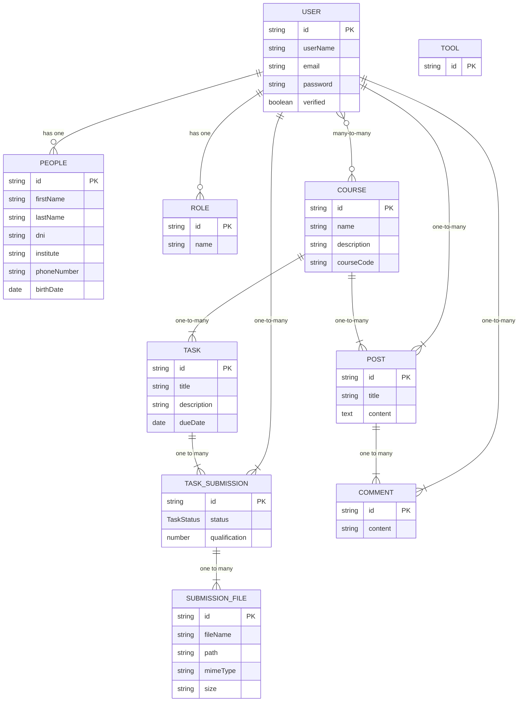
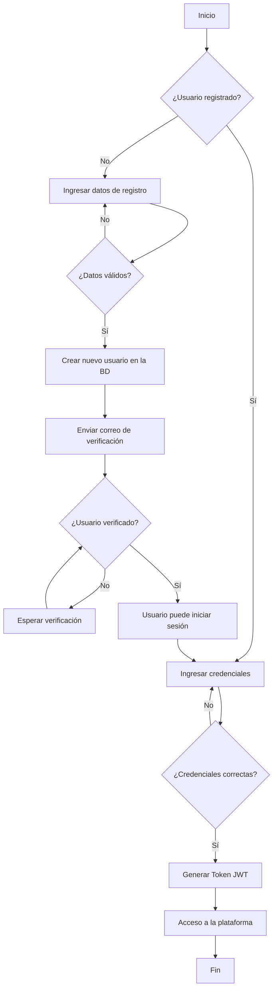
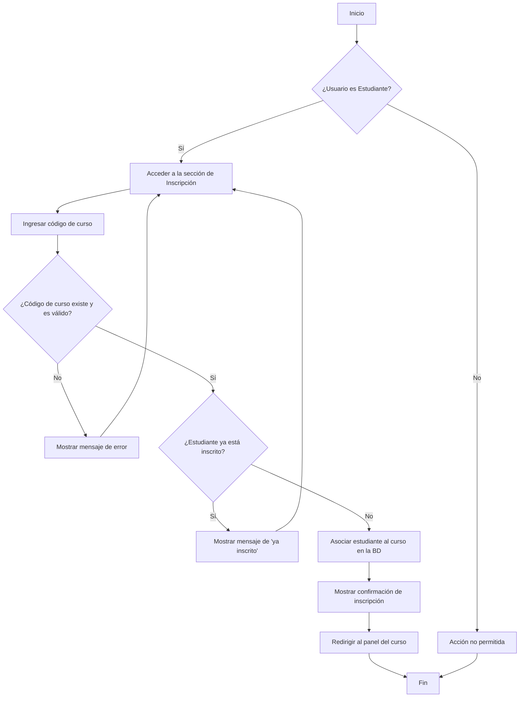
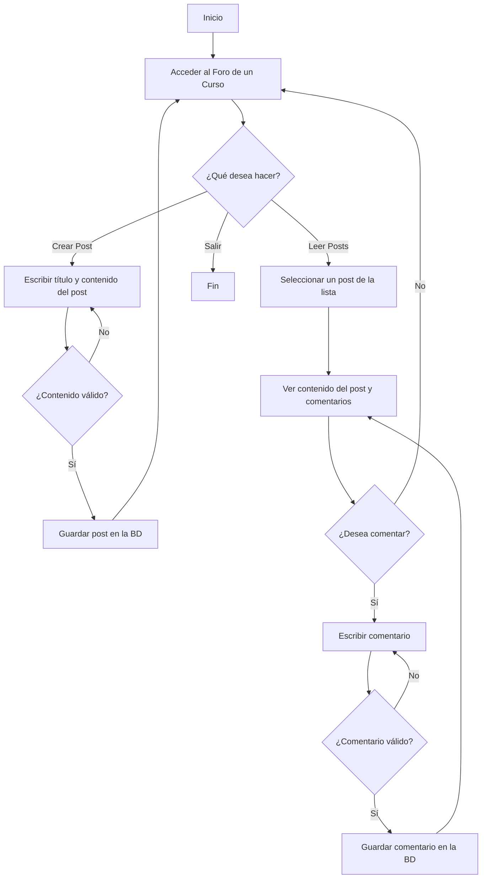

# Documentación del Proyecto: LEXIMATE

## 1. Introducción

Este documento proporciona una descripción técnica detallada de la plataforma LEXIMATE, una aplicación web educativa diseñada para apoyar a estudiantes con dislexia. Se describe la arquitectura del backend, el modelo de datos, los flujos de trabajo y los endpoints de la API.

## 2. Objetivo de la Documentación

El objetivo de esta documentación es servir como una guía central para los desarrolladores, facilitando la comprensión del sistema, la incorporación de nuevos miembros al equipo y el mantenimiento futuro de la aplicación.

## 3. Arquitectura del Sistema

La aplicación sigue una arquitectura de microservicios (módulos de NestJS) con una base de datos centralizada.

- **Backend**: NestJS (Node.js)
- **Base de Datos**: PostgreSQL
- **Autenticación**: JWT (JSON Web Tokens)

## 4. Plan de Documentación

A continuación, se presenta el plan para documentar el proyecto:

- **4.1. Diagrama de Entidad-Relación (ERD)**: Se creará un diagrama Mermaid para visualizar la estructura de la base de datos y las relaciones entre las entidades.
- **4.2. Descripción de Módulos y Endpoints**: Se documentará cada módulo (User, Course, Task, Post, Comment, Tool) con sus respectivos endpoints, DTOs (Data Transfer Objects) y lógica de negocio.
- **4.3. Diagramas de Flujo**: Se crearán diagramas para los siguientes flujos de usuario principales:
  - Registro e Inicio de Sesión de Usuario.
  - Creación y Gestión de Cursos (Profesor).

### 4.1. Diagrama de Entidad-Relación (ERD)

A continuación, se muestra el diagrama de la base de datos que representa las entidades y sus relaciones.



- Inscripción a un Curso (Estudiante).
- Creación y Entrega de Tareas.
- Interacción en el Foro (Creación de Posts y Comentarios).
- **4.4. Generación del Documento Final**: Se consolidará toda la información en este archivo `README.md`.

### 4.2. Diagramas de Flujo

#### 4.2.1. Flujo de Registro e Inicio de Sesión



#### 4.2.2. Flujo de Creación y Gestión de Cursos (Profesor)

```mermaid
graph TD
    A[Inicio] --> B{¿Usuario es Profesor?};
    B -- No --> Z[Acción no permitida];
    B -- Sí --> C[Acceder a la sección de Cursos];
    C --> D{¿Qué acción desea realizar?};
    D -- Crear Curso --> E[Ingresar detalles del nuevo curso];
    E --> F{¿Datos válidos?};
    F -- No --> E;
    F -- Sí --> G[Guardar curso en la BD];
    G --> H[Generar código de curso];
    H --> C;
    D -- Modificar Curso --> I[Seleccionar curso a modificar];
    I --> J[Actualizar información del curso];
    J --> K{¿Datos válidos?};
    K -- No --> J;
    K -- Sí --> L[Guardar cambios en la BD];
    L --> C;
    D -- Eliminar Curso --> M[Seleccionar curso a eliminar];
    M --> N[Confirmar eliminación];
    N -- Sí --> O[Eliminar curso de la BD (Soft Delete)];
    O --> C;
    N -- No --> C;
    Z --> End[Fin];
    C --> End;
```

#### 4.2.3. Flujo de Inscripción a un Curso (Estudiante)



#### 4.2.4. Flujo de Creación y Entrega de Tareas

```mermaid
graph TD
    subgraph "Flujo del Profesor"
        A[Inicio] --> B{¿Usuario es Profesor?};
        B -- No --> Z[Acción no permitida];
        B -- Sí --> C[Seleccionar un curso];
        C --> D[Crear nueva tarea];
        D --> E[Ingresar título, descripción y fecha de entrega];
        E --> F{¿Datos válidos?};
        F -- No --> E;
        F -- Sí --> G[Guardar tarea en la BD];
        G --> H[Notificar a los estudiantes del curso];
        H --> I[Fin Profesor];
    end

    subgraph "Flujo del Estudiante"
        J[Inicio] --> K{¿Usuario es Estudiante?};
        K -- No --> Z;
        K -- Sí --> L[Seleccionar un curso];
        L --> M[Ver tareas pendientes];
        M --> N[Seleccionar una tarea];
        N --> O[Preparar la entrega (archivos, texto)];
        O --> P[Enviar entrega];
        P --> Q[Guardar entrega en la BD];
        Q --> R{¿Calificación disponible?};
        R -- No --> S[Esperar calificación];
        S --> R;
        R -- Sí --> T[Ver calificación y feedback];
        T --> U[Fin Estudiante];
    end

    Z --> End[Fin];
```

#### 4.2.5. Flujo de Interacción en el Foro



## 5. Descripción de Módulos y Endpoints de la API

A continuación se detallan los endpoints disponibles para cada módulo del backend.

### 5.1. Módulo `User`

- **Ruta base**: `/api/user`

| Método   | Ruta          | Descripción                              | DTO (Payload)   |
| :------- | :------------ | :--------------------------------------- | :-------------- |
| `POST`   | `/`           | Crea un nuevo usuario.                   | `CreateUserDto` |
| `GET`    | `/`           | Obtiene una lista de todos los usuarios. | N/A             |
| `GET`    | `/:id`        | Obtiene un usuario específico por su ID. | N/A             |
| `PATCH`  | `/:id`        | Actualiza un usuario existente.          | `UpdateUserDto` |
| `DELETE` | `/:id`        | Elimina un usuario (soft delete).        | N/A             |
| `GET`    | `/seed-roles` | Inicializa los roles básicos en la BD.   | N/A             |

### 5.2. Módulo `Course`

- **Ruta base**: `/api/course`

| Método   | Ruta   | Descripción                            | DTO (Payload)     |
| :------- | :----- | :------------------------------------- | :---------------- |
| `POST`   | `/`    | Crea un nuevo curso.                   | `CreateCourseDto` |
| `GET`    | `/`    | Obtiene una lista de todos los cursos. | N/A               |
| `GET`    | `/:id` | Obtiene un curso específico por su ID. | N/A               |
| `PATCH`  | `/:id` | Actualiza un curso existente.          | `UpdateCourseDto` |
| `DELETE` | `/:id` | Elimina un curso (soft delete).        | N/A               |

### 5.3. Módulo `Task`

- **Ruta base**: `/api/task`

| Método   | Ruta   | Descripción                             | DTO (Payload)   |
| :------- | :----- | :-------------------------------------- | :-------------- |
| `POST`   | `/`    | Crea una nueva tarea.                   | `CreateTaskDto` |
| `GET`    | `/`    | Obtiene una lista de todas las tareas.  | N/A             |
| `GET`    | `/:id` | Obtiene una tarea específica por su ID. | N/A             |
| `PATCH`  | `/:id` | Actualiza una tarea existente.          | `UpdateTaskDto` |
| `DELETE` | `/:id` | Elimina una tarea (soft delete).        | N/A             |

### 5.4. Módulo `Post`

- **Ruta base**: `/api/post`

| Método   | Ruta   | Descripción                                   | DTO (Payload)   |
| :------- | :----- | :-------------------------------------------- | :-------------- |
| `POST`   | `/`    | Crea una nueva publicación en el foro.        | `CreatePostDto` |
| `GET`    | `/`    | Obtiene una lista de todas las publicaciones. | N/A             |
| `GET`    | `/:id` | Obtiene una publicación específica por su ID. | N/A             |
| `PATCH`  | `/:id` | Actualiza una publicación existente.          | `UpdatePostDto` |
| `DELETE` | `/:id` | Elimina una publicación (soft delete).        | N/A             |

### 5.5. Módulo `Comment`

- **Ruta base**: `/api/comment`

| Método   | Ruta   | Descripción                                  | DTO (Payload)      |
| :------- | :----- | :------------------------------------------- | :----------------- |
| `POST`   | `/`    | Crea un nuevo comentario en una publicación. | `CreateCommentDto` |
| `GET`    | `/`    | Obtiene una lista de todos los comentarios.  | N/A                |
| `GET`    | `/:id` | Obtiene un comentario específico por su ID.  | N/A                |
| `PATCH`  | `/:id` | Actualiza un comentario existente.           | `UpdateCommentDto` |
| `DELETE` | `/:id` | Elimina un comentario (soft delete).         | N/A                |

### 5.6. Módulo `Tool`

- **Ruta base**: `/api/tool`

| Método   | Ruta   | Descripción                                   | DTO (Payload)   |
| :------- | :----- | :-------------------------------------------- | :-------------- |
| `POST`   | `/`    | Crea una nueva herramienta.                   | `CreateToolDto` |
| `GET`    | `/`    | Obtiene una lista de todas las herramientas.  | N/A             |
| `GET`    | `/:id` | Obtiene una herramienta específica por su ID. | N/A             |
| `PATCH`  | `/:id` | Actualiza una herramienta existente.          | `UpdateToolDto` |
| `DELETE` | `/:id` | Elimina una herramienta (soft delete).        | N/A             |
